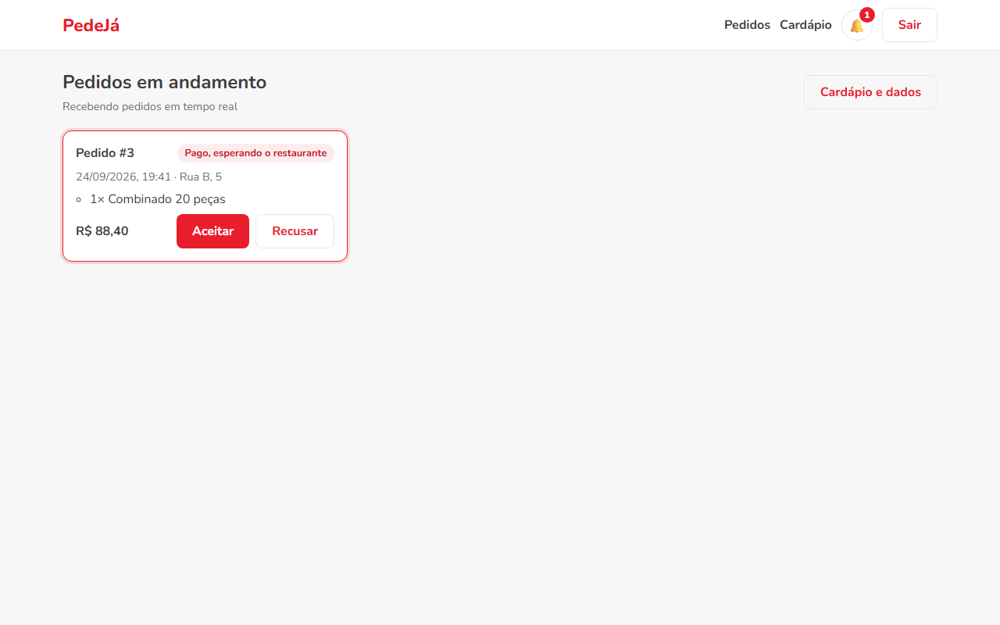
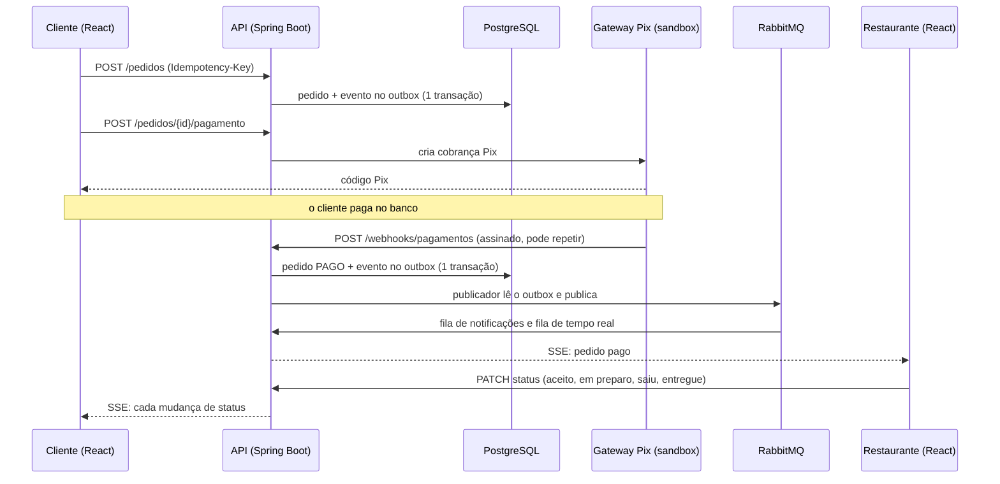
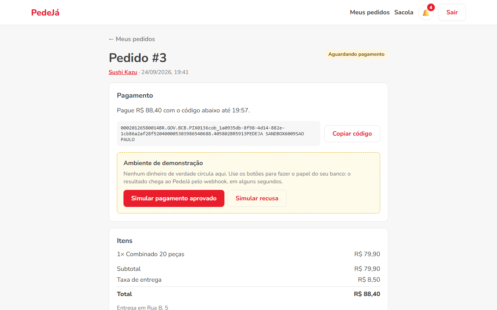

# PedeJá

[](https://github.com/msampaio-dev/PedeJa/actions/workflows/ci.yml)
[](https://openjdk.org/projects/jdk/21/)
[](https://spring.io/projects/spring-boot)
[](https://www.rabbitmq.com/)
[](LICENSE)

Uma versão simplificada do iFood, com backend em Java e Spring Boot e frontend em React. O cliente escolhe o restaurante, monta a sacola e paga com Pix. O pagamento é confirmado depois, por um webhook assinado, e o restaurante recebe o pedido na tela na mesma hora, sem recarregar a página.



## Destaques

- Um webhook entregue duas vezes muda o pedido uma vez só. O id de cada evento é gravado na mesma transação que processa o pagamento.
- O webhook confere uma assinatura HMAC-SHA256 do corpo, com prazo de 5 minutos. Um POST forjado, um corpo alterado ou uma notificação antiga reenviada recebem 401.
- Clique duplo em "Fazer pedido" não cria dois pedidos. O frontend manda uma chave de idempotência, e a mesma chave devolve o pedido que já existe.
- Nenhuma mudança de status se perde, mesmo com o RabbitMQ fora do ar. O evento vai para uma tabela de outbox na mesma transação e é publicado depois, com confirmação do broker.
- O pedido guarda uma cópia do preço de cada item. Se o restaurante mudar o cardápio amanhã, o pedido de hoje continua com o valor que foi pago.
- O restaurante vê o pedido pago aparecer em poucos segundos, por Server-Sent Events alimentados pelo RabbitMQ.
- Os 52 testes do backend rodam com PostgreSQL e RabbitMQ reais, em containers descartáveis.

## O fluxo de um pedido



O pedido segue uma máquina de estados. Cancelar só vale antes do pagamento; depois disso, quem decide é o restaurante.

```text
AGUARDANDO_PAGAMENTO ──► PAGO ──► ACEITO ──► EM_PREPARO ──► SAIU_PARA_ENTREGA ──► ENTREGUE
         │                 │
         ▼                 ▼
     CANCELADO          RECUSADO
```

Qualquer outra transição responde 409. O restaurante não enxerga pedido que ainda não foi pago.

Na demonstração, um simulador faz o papel do restaurante e do entregador. Um job a cada 3 segundos procura pedidos pagos parados e avança cada um para o próximo status: aceito depois de 10 segundos, em preparo depois de mais 5, saiu para entrega depois de 20 e entregue depois de outros 20. O prazo conta a partir da última mudança, então o restaurante pode adiantar qualquer etapa pelo painel. O job trava os pedidos com `FOR UPDATE SKIP LOCKED` e usa a mesma máquina de estados, então cada passo gera histórico, notificação e aviso em tempo real. A variável `SIMULACAO_ENTREGA_ENABLED=false` desliga o simulador.

## Pagamento e webhook

O gateway é uma interface, `GatewayPagamento`. A implementação atual é um sandbox que roda dentro da aplicação, mas se comporta como um sistema externo: guarda as cobranças na própria memória e avisa o resultado por HTTP, no webhook. Ele entrega cada notificação duas vezes de propósito, tenta de novo com espera crescente quando a API não responde 2xx e assina cada tentativa com um timestamp novo. Trocar pelo Mercado Pago ou pelo Stripe é escrever outra implementação da interface.



Quando a notificação chega:

1. A assinatura é conferida sobre o corpo exato recebido, por isso ele chega como texto e só depois vira objeto. A comparação é feita em tempo constante.
2. O id do evento entra na tabela `webhook_eventos_processados` com `INSERT ... ON CONFLICT DO NOTHING`. Se nenhuma linha foi inserida, é repetição, e a API responde 200 sem fazer nada.
3. A linha do pedido é travada com `SELECT ... FOR UPDATE`. O cancelamento trava a mesma linha, na mesma ordem, então os dois nunca decidem em cima de um status desatualizado.
4. Pagamento aprovado e pedido `PAGO` são gravados. Se algo falhar no meio, tudo volta, inclusive o registro do evento, e o gateway reenvia.

A cobrança Pix vence em 15 minutos. Pedir o pagamento de novo dentro do prazo devolve a mesma cobrança. O cancelamento espera a cobrança em aberto vencer, porque o cliente pode pagar a qualquer momento.

## Eventos e tempo real

```text
                                  pedido.status.#
                        ┌──────────────────────────► pedeja.notificacoes ──(3 falhas)──► DLQ
outbox ──► pedeja.pedidos (topic)
                        └──────────────────────────► fila anônima de cada instância ──► SSE
```

Cada mudança de status vira um evento de domínio (`@DomainEvents`) que um listener grava na tabela `outbox_eventos`, dentro da transação de quem salvou o pedido. Um publicador agendado lê o outbox com `FOR UPDATE SKIP LOCKED`, publica no RabbitMQ e só marca como publicado depois do ack do broker. A entrega é "pelo menos uma vez", e os consumidores descartam repetições pelo id do evento.

A fila de notificações é uma só, dividida entre as instâncias da API, para cada aviso ser gravado uma vez; mensagem que falha 3 vezes vai para a DLQ. A de tempo real é anônima e exclusiva de cada instância, porque o navegador pode estar conectado em qualquer uma delas.

O frontend abre o SSE com `fetch` em vez de `EventSource`. O `EventSource` não envia o header `Authorization`, e colocar o token na URL o deixaria em log de proxy. A conexão manda um ping a cada 25 segundos e o frontend reconecta sozinho, com espera crescente.

## Decisões técnicas

| Decisão | Por quê |
|---|---|
| Monólito modular | Um deploy só, com cada funcionalidade no seu pacote. O RabbitMQ desacopla apenas a parte assíncrona. |
| Preço recalculado no servidor | O cliente manda só id e quantidade. Preço vindo do navegador pode ter sido alterado. |
| `BigDecimal` e `NUMERIC(10,2)` | Dinheiro em `double` gera centavo fantasma. O banco ainda confere `total = subtotal + taxa_entrega` com uma constraint. |
| Transactional outbox | Publicar no RabbitMQ dentro da transação arrisca mensagem de algo que foi desfeito; publicar depois arrisca perder a mensagem se a API cair. Com o outbox, nenhum dos dois acontece. |
| Lock pessimista no pedido | Mudanças de status concorrentes (webhook, cancelamento, restaurante) passam uma de cada vez. |
| Specification na busca | Filtro ausente não entra no `WHERE`. A alternativa `(:categoria IS NULL OR ...)` esbarra no PostgreSQL, que não deduz o tipo de parâmetro nulo. |
| Batch fetch | A lista de pedidos do restaurante carrega itens e histórico em lotes com `IN (...)`, em vez de uma consulta por pedido. |
| Um perfil por conta | Quem pede e quem vende são pessoas diferentes. O JWT leva só a claim `perfil`. |
| Item de cardápio não se apaga | Os pedidos apontam para ele. O dono marca como indisponível. |
| Testcontainers | Outbox, `SKIP LOCKED`, `ON CONFLICT` e DLQ dependem do PostgreSQL e do RabbitMQ reais. |

## Stack

Backend: Java 21, Spring Boot 3.5 (Web, Data JPA, Security, Validation, AMQP), PostgreSQL 16, Flyway, RabbitMQ 4, JWT, Swagger.

Frontend: React 19, TypeScript, Vite e React Router.

Testes e entrega: JUnit 5, Testcontainers, Awaitility, Vitest, Testing Library, GitHub Actions e Docker.

## Rodando localmente

Pré-requisitos: Java 21, Node 24 e Docker.

Suba o PostgreSQL e o RabbitMQ:

```bash
docker compose up -d
```

Suba a API, que cria as tabelas e carrega os restaurantes de demonstração:

```bash
cd backend && ./mvnw spring-boot:run
```

Suba o frontend:

```bash
cd frontend && npm install && npm run dev
```

A API fica em `http://localhost:8080` e o frontend em `http://localhost:5173`. O painel do RabbitMQ fica em `http://localhost:15672`, com usuário e senha `guest`.

Contas de demonstração, todas com a senha `Demo123!`:

| Conta | Perfil |
|---|---|
| `cliente@demo.pedeja.local` | Cliente |
| `restaurante@demo.pedeja.local` | Cantina da Nona |
| `burger@demo.pedeja.local` | Burger do Bairro |
| `sushi@demo.pedeja.local` | Sushi Kazu |

A tela de login tem botões que entram direto como cliente ou como restaurante.

## Documentação da API

Com a API rodando, o Swagger fica em `http://localhost:8080/swagger-ui.html`. Todos os endpoints usam o prefixo `/api/v1`.

| Recurso | Endpoints |
|---|---|
| Autenticação | `POST /auth/cadastro`, `POST /auth/login`, `GET /auth/me` |
| Restaurantes (público) | `GET /restaurantes`, `GET /restaurantes/{id}/cardapio`, `POST /restaurantes/cadastro` |
| Área do restaurante | `/meu-restaurante`, `/meu-restaurante/itens`, `/meu-restaurante/pedidos` |
| Pedidos do cliente | `POST /pedidos`, `GET /pedidos`, `GET /pedidos/{id}`, `POST /pedidos/{id}/cancelamento` |
| Pagamento | `POST /pedidos/{id}/pagamento`, `GET /pedidos/{id}/pagamento` |
| Webhook | `POST /webhooks/pagamentos` (assinado, sem JWT) |
| Tempo real | `GET /eventos` (SSE), `GET /notificacoes`, `POST /notificacoes/lidas` |
| Sandbox | `POST /gateway-fake/cobrancas/{id}/simulacao` |

## Testes

```bash
cd backend && ./mvnw verify
```

```bash
cd frontend && npm test
```

São 52 testes de integração no backend e 16 no frontend. Entre os casos cobertos:

- webhook repetido, com assinatura errada, com corpo alterado e assinado há mais de 5 minutos;
- pagamento simulado no sandbox chegando pelo webhook por HTTP, em dobro, e pagando o pedido uma vez só;
- mesma chave de idempotência devolvendo o mesmo pedido;
- preço alterado depois do pedido sem mudar o total já cobrado;
- cada transição válida e inválida da máquina de estados;
- transação desfeita sem deixar evento no outbox;
- mensagem repetida sem duplicar notificação e mensagem ilegível indo para a DLQ;
- conexão SSE recebendo a mudança do pedido e saindo do canal quando o cliente fecha;
- simulador levando o pedido pago até entregue, sem tocar em pedido não pago ou recusado.

Cada contexto do Spring nos testes usa um banco e um conjunto de filas próprios, para um não consumir a mensagem do outro. O GitHub Actions roda as duas suítes em todo push e pull request.

## Deploy

A configuração está pronta para o plano gratuito de quatro serviços:

| Parte | Serviço | Arquivo |
|---|---|---|
| API | Render (Docker) | [`render.yaml`](render.yaml) e [`backend/Dockerfile`](backend/Dockerfile) |
| Frontend | Vercel | [`frontend/vercel.json`](frontend/vercel.json) |
| Banco | Neon | variáveis `DB_URL`, `DB_USERNAME` e `DB_PASSWORD` |
| RabbitMQ | CloudAMQP | variável `RABBITMQ_URL` |

No Render, o blueprint gera `JWT_SECRET` e `WEBHOOK_SECRET` sozinho. Na Vercel, a pasta raiz do projeto é `frontend` e a variável `VITE_API_URL` aponta para a API com `/api/v1` no final. Banco e broker precisam estar na mesma região da API (Oregon, `us-west-2`).

## Limitações conhecidas

- Não há estorno. Se um pagamento for aprovado depois que o pedido foi cancelado (cobrança vencida e paga no último segundo), a API só registra um aviso no log.
- O sandbox de pagamento é público, e qualquer um pode aprovar uma cobrança dele. Ele existe só para demonstração e não existiria numa integração real.
- O sandbox guarda as cobranças em memória. Reiniciar a API apaga as cobranças pendentes, e o cliente precisa gerar outra.
- O plano gratuito do Render hiberna depois de 15 minutos sem tráfego, e a primeira requisição depois disso demora.
- Não há entregador. A entrega é um status que o restaurante atualiza ou que o simulador avança sozinho, e o simulador nunca recusa pedidos.

## Autor

Desenvolvido por Marcelo Sampaio como projeto de portfólio, depois do [AgendaPro](https://github.com/msampaio-dev/AgendaPro). O raciocínio de cada etapa está nas mensagens de commit.

- GitHub: [@msampaio-dev](https://github.com/msampaio-dev)
